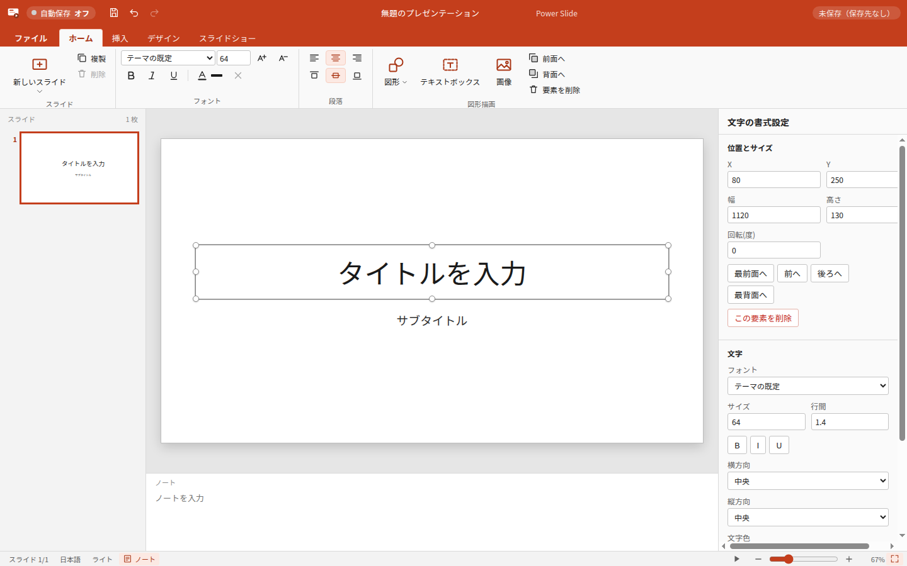

# Power Slide

PowerPoint 風のスライドを作成・編集・発表・書き出しできるデスクトップアプリ（Electron + React + TypeScript）。

資料をオンラインサービスに預けずに、手元のファイルとしてスライドをつくり、
PowerPoint / PDF / PNG に書き出せることを目的にしています。UI はすべて日本語です。

## 画面



PowerPoint に倣った構成です。上からタイトルバー（自動保存の状態・クイックアクセス・
プレゼンテーション名）、リボン（ファイル／ホーム／挿入／デザイン／スライドショー）、
左にスライド一覧、中央にキャンバスとノート、右に「書式設定」の作業ウィンドウ、
最下段にステータスバー（スライド番号・ノートの表示切替・スライドショー・ズーム）。

- **ホーム** — 新しいスライド（レイアウト一覧付き）、フォント（書体・サイズ・太字／斜体／下線・色）、
  段落（左右・上下の配置）、図形描画（図形・テキストボックス・画像・重なり順）
- **挿入** — 画像・図形・テキストボックス
- **デザイン** — テーマのギャラリー、スライドの背景色
- **スライドショー** — 最初から／現在のスライドから、ノート欄の表示切替
- **ファイル** — 新規・開く・保存・名前を付けて保存・エクスポート（pptx / PDF / PNG）・最近使ったファイル

## できること

**編集**

- スライド一覧（サムネイル付き）／追加・複製・削除・ドラッグで並べ替え
- レイアウトテンプレート — タイトル / タイトルと本文 / 2 段組み / セクション区切り / 画像と説明 / 白紙
- テキストボックス — その場で編集（日本語入力対応）、フォント・サイズ・行間・太字・斜体・下線・
  文字色・左右そろえ・上下そろえ
- 図形 — 四角形・角丸四角形・円/楕円・三角形・直線・矢印、塗りと枠線の設定、図形内テキスト
- 画像 — ローカルファイルの挿入（`.pslide` に埋め込むのでリンク切れしない）、枠への収め方
- ドラッグでの移動・8 方向ハンドルでのリサイズ・他要素とスライド中心へのスナップ
- 重なり順の変更、複数選択でのまとめて移動、元に戻す／やり直す
- テーマ 5 種（ライト / ダーク / ネイビー / 和紙（明朝） / モノクロ）とスライドごとの背景色

**ファイルの開き方**

- 「ファイル」タブの「開く」、または同じメニューの「最近使ったファイル」（最大 10 件）
- `.pslide` ファイルのダブルクリック（インストーラがアプリを関連付けます）
- すでにアプリが起動していれば、そのウィンドウで開きます（二重起動しません）

**発表**

全画面のスライドショー。スピーカーノートと経過時間タイマーを手元で確認できます。

**保存と書き出し**

| 形式 | 内容 |
| --- | --- |
| `.pslide` | 独自形式（読みやすい JSON）。編集情報をすべて保持する保存用フォーマット |
| `.pptx` | PowerPoint 形式。PowerPoint / Google スライドで開いて編集できる |
| PDF | 1 スライド = 1 ページ。配布・印刷用 |
| PNG | スライドごとに 1280×720 の画像 |

## キーボード操作

**編集画面**

| キー | 動作 |
| --- | --- |
| `Ctrl/⌘ + N` | 新規作成 |
| `Ctrl/⌘ + O` | 開く |
| `Ctrl/⌘ + S` | 保存 |
| `Ctrl/⌘ + Shift + S` | 別名で保存 |
| `Ctrl/⌘ + M` | 新しいスライド |
| `Ctrl/⌘ + T` | テキストボックスを挿入 |
| `Ctrl/⌘ + Z` / `Ctrl/⌘ + Shift + Z` | 元に戻す / やり直す |
| `Ctrl/⌘ + C` / `V` / `D` | コピー / 貼り付け / 複製 |
| 矢印キー（`Shift` 併用で 10px） | 選択中の要素を移動 |
| `Enter` | 選択中のテキストを編集開始 |
| `Delete` / `Backspace` | 選択中の要素を削除 |
| `Esc` | 選択解除 |
| `F5` | スライドショーを最初から開始 |

要素はダブルクリックでその場編集、`Shift` + クリックで追加選択できます。

**スライドショー中**

| キー | 動作 |
| --- | --- |
| `→` `↓` `Space` `PageDown` | 次のスライド |
| `←` `↑` `PageUp` | 前のスライド |
| `Home` / `End` | 先頭 / 末尾 |
| `N` | スピーカーノートの表示切り替え |
| `B` | 黒画面の切り替え |
| `Esc` | スライドショーを終了 |

## 自動保存と「手で直したファイル」の扱い

編集が止まってから 1.5 秒後に自動保存します。ただし次の 2 点を守ります。

1. **保存先が決まっていないデッキ（新規作成直後）は自動保存しません。** 必ず保存ダイアログで
   置き場所を確認します。
2. **アプリの外で書き換えられたファイルは黙って上書きしません。** 書き込む直前に
   ファイルの更新時刻とサイズを、アプリが最後に書いた時点の記録と照合します。食い違ったら
   保存を中断して自動保存を止め、「ディスクの内容を読み込む／編集中の内容で上書きする／
   別名で保存する」を選ぶダイアログを出します。

`.pslide` は整形された JSON なので、テキストエディタで直接手直しすることもできます。
その場合も上の仕組みにより、アプリ側の内容で勝手に潰されることはありません。

## フォント

日本語フォント（Noto Sans JP / Noto Serif JP の Regular・Bold）をアプリに同梱しています。
OS 標準フォントに任せると文字幅と行の折り返し位置が環境ごとに変わり、同じ `.pslide` でも
見た目がずれるためです。ライセンスは SIL Open Font License 1.1 で、
`src/renderer/src/assets/fonts/OFL.txt` を同梱しています。

書き出し先によって扱いが異なります。

| 書き出し先 | フォントの扱い |
| --- | --- |
| PDF / PNG | 同梱フォントのサブセットが埋め込まれる（どの PC で開いても同じ見た目） |
| `.pptx` | 相手の PowerPoint で開かれるため、Windows / Office 標準の游ゴシック・游明朝を指定する |

`.pptx` でだけ游書体を指定しているのは、pptx がフォントを埋め込まない形式で、
受け取った側の PC にある書体で描画されるためです。対応表は `src/shared/fonts.ts` にあります。

## 開発

```bash
npm install          # 依存関係のインストール
npm run dev          # 開発モードで起動（HMR あり）
npm run typecheck    # TypeScript の型チェック
npm run lint         # ESLint
npm run build        # main / preload / renderer をビルド
npm run test:smoke   # ビルドしてから E2E スモークテスト（Playwright + Electron）
```

Linux の CI やヘッドレス環境では `npm run test:smoke` が仮想ディスプレイ（`xvfb-run`）を
使うので、`xvfb` が必要です。

### アプリアイコン

原本は `build/icon.svg`、electron-builder が読むのは `build/icon.png`（1024×1024）です。
SVG を描き直したら `node scripts/render-icon.mjs` で PNG を作り直してください
（Playwright 同梱の Chromium で描画します）。Windows の `.ico` と macOS の `.icns` は
electron-builder がこの PNG から自動生成します。

### 配布用パッケージ

```bash
npm run pack:dir     # パッケージの中身だけを out/ に展開（動作確認用）
npm run dist         # インストーラを release/ に作成
```

`electron-builder.yml` の設定は Windows: NSIS インストーラ、macOS: dmg（arm64 + x64）、
Linux: AppImage です。各 OS 向けのインストーラは、その OS 上でビルドする必要があります。

**3 OS 分をまとめて作るには、GitHub Actions を使ってください。** `v1.0.0` のようなタグを
push すると `.github/workflows/release.yml` が Windows / macOS / Linux で並行ビルドし、
成果物を GitHub Releases の下書きに添付します。

```bash
git tag v0.1.0 && git push origin v0.1.0
```

Actions の画面から手動実行（Run workflow）した場合は、リリースは作らず Artifacts に
インストーラを残します。

署名は設定していません。そのため初回起動時に OS の警告が出ます（Windows は
「詳細情報」→「実行」、macOS は右クリック →「開く」）。配布先を選ばず使いたい場合は、
Windows のコード署名証明書と Apple Developer Program の登録が別途必要です。
証明書を用意したら、`release.yml` のビルド手順に `CSC_LINK` などを secrets から
渡すと electron-builder が署名します。

### CI

`.github/workflows/ci.yml` が push と pull request のたびに、型チェック・Lint・
E2E スモークテスト（Ubuntu + xvfb）を実行します。

## 構成

```
src/
├─ main/        Electron main。ウィンドウ、日本語メニュー、ファイル I/O、書き出し
│  ├─ file/     .pslide の読み書きと外部変更の検知
│  └─ export/   pptx（pptxgenjs）/ PDF（printToPDF）/ PNG（capturePage）
├─ preload/     contextBridge で公開する API（renderer から fs は触れない）
├─ shared/      両プロセスで共有する型・座標系・テーマ・レイアウト
└─ renderer/    React の編集画面
   └─ src/
      ├─ store/       zustand（デッキ本体と履歴）
      ├─ components/  タイトルバー・リボン（ribbon/）・スライド一覧・キャンバス・
      │               書式設定・ステータスバー・発表者モード
      ├─ hooks/       自動保存・メニュー連携・ショートカット
      └─ routes/      書き出し専用ルート（#/render）
```

### 座標系

すべての座標・サイズ・フォントサイズは **1280×720 の論理 px** で保持し、表示側は
CSS `transform: scale()` で拡縮するだけです。編集画面・サムネイル・発表画面・書き出しが
同じ DOM を共有するため、見た目がずれません。

96px = 1inch としているので、スライドは 13.3333 × 7.5 inch（PowerPoint のワイド画面の
既定サイズ）と完全に一致し、フォントサイズは `px × 0.75 = pt` でそのまま換算できます。

### 既知の制約

- PNG の書き出しサイズはウィンドウの実ピクセルに依存するため、1280×720 を基準にしています
  （ディスプレイがそれより小さい場合は、同じ寸法になるよう拡大して保存します）。
- 書式は要素単位で設定します（1 つのテキストボックスの中で一部だけ色を変えることはできません）。
  ファイル形式は文字単位の書式を持てる構造になっているため、将来の拡張は可能です。
- 要素の回転は数値入力で指定します（ハンドルでの回転操作は未実装）。
- `.pptx` はフォントを埋め込まない形式のため、受け取った側の PC に游ゴシック・游明朝が
  ないと別の書体で表示されます。見た目を確実に保ちたい場合は PDF を使ってください。
- 同梱フォントは可変フォントではなく Regular / Bold の静的インスタンスです。可変フォントだと
  Chromium が PDF にフォントを埋め込まなくなるためで、詳細は
  `src/renderer/src/assets/fonts/README.md` に書いています。
